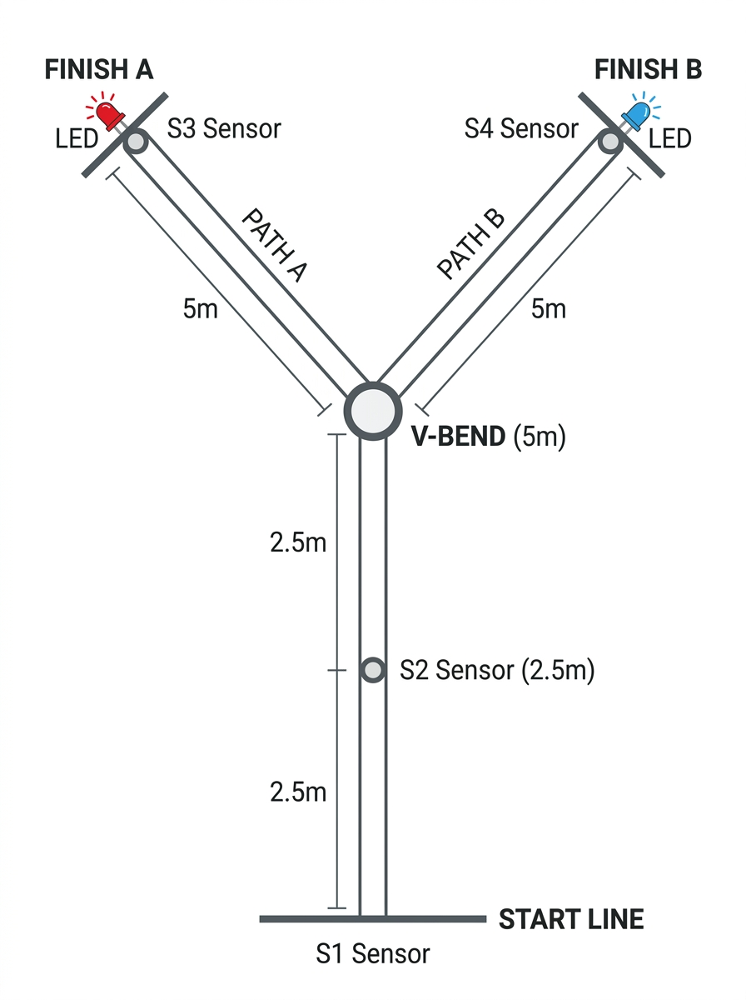

# Agility Runner Timer System

An Arduino-based agility timer designed to test a runner's **reaction time, speed, and agility**. Four ultrasonic sensors act as timing gates, a 128×64 OLED shows real-time feedback, and a randomized path decision at the V-Bend keeps every run unpredictable.

---

## Course Layout

```
  [FINISH A]          [FINISH B]
  S3 + LED A          S4 + LED B
       \    ← 5m →       /
        \               /
         \             /
          \           /
           [ V-BEND ] ← 5m from each finish
                |
              2.5m
                |
           [ S2 Sensor ]
                |
              2.5m
                |
          [ START LINE ]
             S1 Sensor
```



### Distance Reference

| Segment                        | Distance |
| ------------------------------ | -------- |
| Start Line (S1) → S2           | 2.5 m    |
| S2 → V-Bend (turn point)       | 2.5 m    |
| V-Bend → Finish A (S3)         | 5.0 m    |
| V-Bend → Finish B (S4)         | 5.0 m    |
| **Total run (one path)**       | **10 m** |

---

## How It Works

1. **Start**: Runner stands at the Start Line. S1 detects them at < 100 cm.
2. **Timer begins**: The moment they leave the start gate (S1 clears), the clock starts.
3. **S2 at 2.5 m**: Mid-point sensor. When triggered, the random path is chosen and the corresponding LED at the finish line lights up.
4. **V-Bend at 5 m**: The runner reaches the turning point and must react to the illuminated finish LED.
5. **Finish**: Runner crosses the correct finish gate (S3 or S4). Timer stops and final time is shown on the OLED.
6. **Reset**: Press the physical button to start the next run.

> **The two LEDs are placed physically at the Finish A and Finish B gates** so the runner can see which direction to sprint the moment the light comes on at the V-Bend.

---

## Features

- 4-point ultrasonic gate tracking (S1 Start → S2 Mid → S3/S4 Finish A/B)
- Randomized path selection — decided the instant the runner hits S2
- Indicator LEDs at each finish gate for instant directional cue
- OLED real-time display: state, elapsed time, and live distance readouts
- Built-in calibration mode showing all 4 sensor distances live

---

## Hardware Requirements

| Component                          | Qty |
| ---------------------------------- | --- |
| Arduino Uno (or compatible)        | 1   |
| HC-SR04 Ultrasonic Sensors         | 4   |
| SSD1306 SPI OLED Display (128×64)  | 1   |
| LEDs (red for Path A, blue for B)  | 2   |
| Current-limiting resistors (~220 Ω) | 2   |
| Push button                        | 1   |
| Jumper wires + breadboards         | —   |

---

## Wiring & Pinout

### OLED Display (SPI — SSD1306)

| Display Pin | Arduino Pin |
| ----------- | ----------- |
| GND         | GND         |
| VDD / VCC   | 5 V         |
| SCK / D0    | 13          |
| SDA / D1    | 11          |
| DC          | 8           |
| CS          | 7           |
| RES         | 6           |

### Ultrasonic Sensors (HC-SR04)

> All sensors share 5 V and GND rails.

| Sensor | Physical Position | TRIG | ECHO |
| ------ | ----------------- | ---- | ---- |
| **S1** | Start Line (0 m)  | 9    | 10   |
| **S2** | Mid Gate (2.5 m)  | A0   | A1   |
| **S3** | Finish A (10 m)   | A2   | A3   |
| **S4** | Finish B (10 m)   | A4   | A5   |

### LEDs & Button

> Place the LEDs physically **at the finish line gates** so the runner can see the signal from the V-Bend.

| Component          | Arduino Pin | Notes                                            |
| ------------------ | ----------- | ------------------------------------------------ |
| Path A LED (red)   | 3           | Positive → Pin 3, Negative → GND via 220 Ω      |
| Path B LED (blue)  | 4           | Positive → Pin 4, Negative → GND via 220 Ω      |
| Reset Button       | 2           | Between Pin 2 and GND (internal pull-up enabled) |

---

## Physical Setup

1. **Lay out the course**: Use tape or cones to mark the start, the 2.5 m mid-point, the V-Bend at 5 m, and both finish lines at 10 m from start.
2. **Mount sensors**: Use small posts or stands. Each sensor gate should have two sidebars roughly 1 m apart.
3. **Place LEDs at finish lines**: Mount the Path A LED at the Finish A gate and the Path B LED at the Finish B gate, positioned so they are clearly visible from the V-Bend.
4. **Connect wiring**: Wire sensors and LEDs to the Arduino. Run long cable if needed (the finish lines are 10 m away).
5. **Power**: Power the Arduino via USB from a laptop/power bank carried to the start area or via a long cable.

---

## Installation (PlatformIO)

1. Install [VS Code](https://code.visualstudio.com/) and the [PlatformIO IDE extension](https://platformio.org/install/ide?install=vscode).
2. Open the `runner-agility-test/` folder in VS Code.
3. PlatformIO reads `platformio.ini` and auto-installs:
   - `adafruit/Adafruit SSD1306 @ ^2.5.7`
   - `adafruit/Adafruit GFX Library @ ^1.11.5`
4. Connect the Arduino Uno.
5. Click **Upload** (→ arrow in the PlatformIO toolbar).

---

## Operating Instructions

| Step | What to do |
| ---- | ---------- |
| 1. Boot | System enters `CALIBRATING` mode. OLED shows live cm readings for all 4 sensors. |
| 2. Calibrate | Adjust gate sidebars until sensor clearance reads ~100 cm (1 m gap). |
| 3. Ready | Press button (or send `R` in Serial Monitor) → `READY` state. |
| 4. Position | Runner steps into start gate. OLED shows `SET...` when S1 detects runner. |
| 5. Go! | Runner leaves start gate → timer begins automatically. |
| 6. Mid gate | Runner hits S2 (2.5 m). Random path chosen. Correct finish LED lights up. |
| 7. V-Bend | Runner reaches turn point (5 m), reads the lit LED, sprints to that finish. |
| 8. Finish | Runner crosses S3 or S4. Timer stops. Time displayed on OLED. |
| 9. Reset | Press button → back to `READY` for next runner. |

---

## Project Structure

```
runner-agility-test/
├── src/
│   └── main.cpp          # All firmware logic
├── include/              # (reserved for future headers)
├── lib/                  # (reserved for local libraries)
├── assets/
│   └── course_layout.jpg # Course diagram
├── platformio.ini        # Build config (board: Arduino Uno)
└── README.md
```
